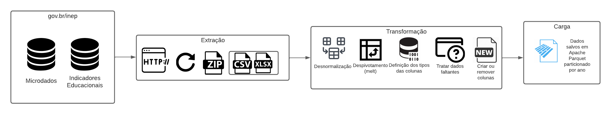
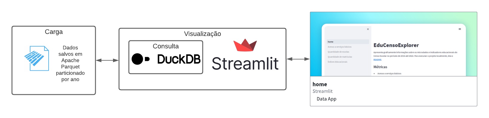

# EduCensoExplorer

ETL e visualização do Censo escolar. [Link para o data app no Streamlit Community Cloud](https://educensoexplorer.streamlit.app/)

Projeto elaborado para o meu TCC: "Uma proposta de extração, transformação, carga e visualização para os dados do Censo Escolar".

[Link para o texto](TCC.pdf)

[Link para os slides](slides.pdf)

## Visão geral

Ferramentas utilizadas: Python "puro" para ETL, Parquet para armazenamento de dados, DuckDB para consulta de dados 
e Streamlit para criação do Data App que resume graficamente os dados extraídos.

Todo o projeto utiliza pacotes Python e, devido a isso, o setup do projeto é feito utilizando Virtualenv.

### ETL

 - A Execução do scripts Python é local e realizada pelo usuário
 - A carga é total devido a periodicidade do dado ser anual
 - Armazenamento dos dados em formato Parquet que são upados para o Github com o objetivo de **facilitar a replicação do projeto** e
**possibilitar o deploy gratuitamente** no Streamlit Community Cloud.



### APP

- Aplicativo Web low-code utilizando Streamlit
- Utiliza os dados armazenados em Parquet através de uma interface de consulta construida com DuckDB




## Setup

- Instale [Python 3.10](https://www.python.org/downloads/)
- Crie um ambiente virtual para o seu Python. Aqui o código utiliando virtualenv:
```python3.10 -m venv venv && source venv/bin/activate```
- Instale as dependências:
```pip install -r requirements.txt```

## Execução

### ETL

Os scripts devem ser executados a partir do caminho raiz do repositório usando
o ambiente virtual criado acima.

### microdados
- [etl/microdados/extract.py](etl/microdados/extract.py)
- [etl/microdados/transform.py](etl/microdados/transform.py)

### indicadores
- [etl/indicadores/extract.py](etl/indicadores/extract.py)
- [etl/indicadores/transform.py](etl/indicadores/transform.py)


### App local

Usando o ambiente virtual criado acima e estando na raiz do repositório, execute
```streamlit run app/home.py```


